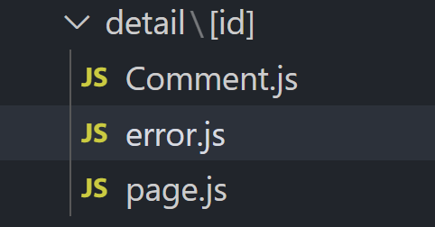
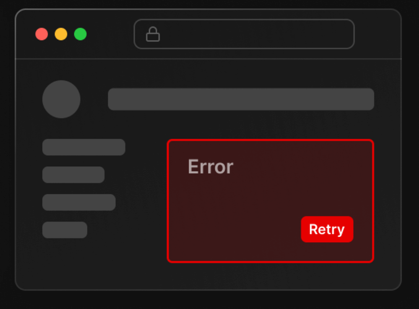

# 에러나면 error.js

페이지 로드시 에러가 나는 경우가 있습니다.

서버가 죽거나, DB에서 이상한 이유로 데이터를 못가져오거나 그런 경우에 에러가 발생할텐데

그 경우 여러분이 직접 if문으로, try catch 문법으로 처리해도 되겠지만

<br/><br/>

<br/>

그게 귀찮으면 error.js 파일 만들어둬도 됩니다.

그럼 page.js에서 에러날 경우 error.js 내용을 옆의 page.js 대신 보여줍니다.

<br/><br/>

```js
(error.js)

'use client'

export default function Error({error, reset}){
  return (
    <div>
      <h4>오 이런 에러남</h4>
      <button onClick={()=>{ reset() }}>다시시도</button>
    </div>
  )
}
```
1. 여긴 항상 client component만 넣을 수 있음

2. error라는 props 출력해보면 에러내용 알려줌

3. reset이라는 props를 ( ) 붙여서 실행하면 해당 페이지를 다시 로드해줍니다.

<br/><br/>

<br/>
▲ 옛날 웹사이트처럼 에러가 나면 페이지 전체가 다운되지 않고

에러난 page.js 부분만 error.js로 대체해서 보여줄 수 있기 때문에

이거 쓰면 좀 더 이뻐보이는 사이트가 완성됩니다.

그래서 중요한 페이지마다 error.js를 추가해두면 좋습니다.


<br/><br/>


Q. error.js 파일이 옆에도 있고 상위 폴더에도 있으면요?


  - page.js에서 에러가 났는데 옆에 error.js 파일이 없으면 상위폴더로 이동하면서 error.js를 찾습니다.\
  그러면서 가장 가까운 error.js 파일을 찾아서 적용해줍니다.\
  - 그래서 유저 편의성 그딴거 신경안쓰고 귀찮으면 app 폴더에 error.js 파일 하나만 만들어둬도 됩니다.\
  (근데 그런 경우 에러나면 최상위 layout.js + error.js 합친 내용만 보이겠군요)


! 실은 loading.js도 똑같이 동작함


<br/><br/>

> ## 참고 : global-error.js


layout.js 내용에서 에러가 나면

layout.js 옆에 있는 error.js 말고 그 상위에 있는 error.js 내용을 보여줍니다.


왜냐면 Next.js에서 페이지를 만들어줄 때

같은 폴더 안에 layout.js / error.js / loading.js / page.js 컴포넌트들이 있으면

layout.js 안에 error.js 안에 loading.js 안에 page.js (또는 하위폴더 layout.js) 컴포넌트를 차례로 감싸는 식으로 보여줍니다.

```js
<Layout>
  <Error fallback={자식들 내용이 에러시 보여줄 error.js 내용}>
    <Loading fallback={자식들 내용이 로딩시 보여줄 loading.js 내용}>
      page.js 내용~~
    </Loading>
  </Error>
</Layout>
```
▲ 실제로 이렇게 싸매서 페이지 하나를 보여줍니다.

그래서 layout.js 는 옆에 있는 error.js로 감싸주지 않기 때문에

layout.js 안에서 에러가 나면 옆에 있던 error.js 보여주고 그런거 못합니다.

layout.js 상위에 있던 error.js 보여줌


<br/><br/>

```js
(app/global-error.js)

'use client'

export default function Error({error, reset}){
  return (
    <div>
      <h4>오 이런 에러남</h4>
      <button onClick={()=>{ reset() }}>다시시도</button>
    </div>
  )
}
```
그래서 사이트 루트경로에 있는 layout.js 에서 에러나면 대신 보여줄 error.js가 없기 때문에

특별한 global-error.js 파일이라는게 있습니다.


최상위 layout.js 옆에 global-error.js 파일 만들어두면

layout.js 안에서 에러시 그거 보여줍니다.

안에 들어갈 내용은 error.js와 동일함

