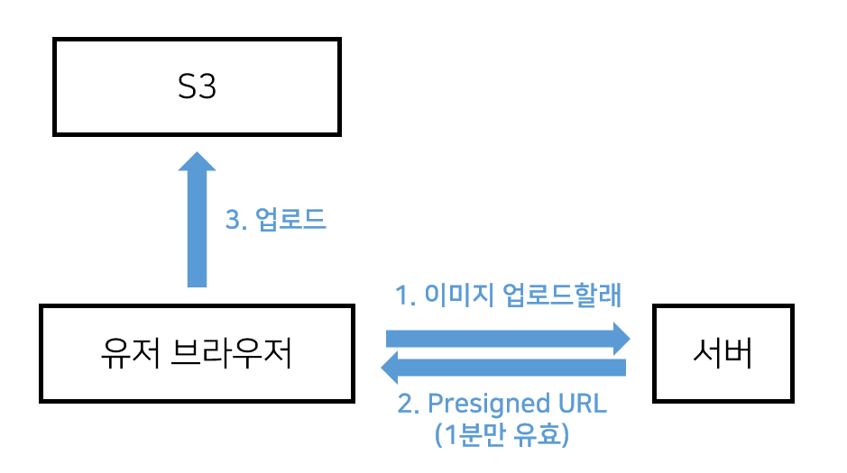

# Presigned-URL 방식으로 이미지 업로드 하는 기능



1. 글작성 페이지의 \<input>에서 유저가 이미지 고르는 순간 서버에게 Presigned URL 달라고 GET요청을 합니다.<br/>
심심하니까 이미지 이름도 같이 보내줌

2. 그럼 서버는 괜찮은 유저인지 이거저거 검사해보고 Presigned URL을 만들어서 유저 브라우저로 보내줌

3. 유저는 브라우저에서 Presigned URL을 이용해서 S3로 이미지를 보냅니다.

4. 성공시 업로드된 이미지의 URL을 에 박아서 이미지 업로드된걸 보여줌


## 현재 프로젝트는 AWS S3를 이용하는 방식임.
```bash
# aws-sdk 를 설치해줘야함, 서버에서 aws 기능 이용하는 라이브러리
npm install aws-sdk
```


```js

```
